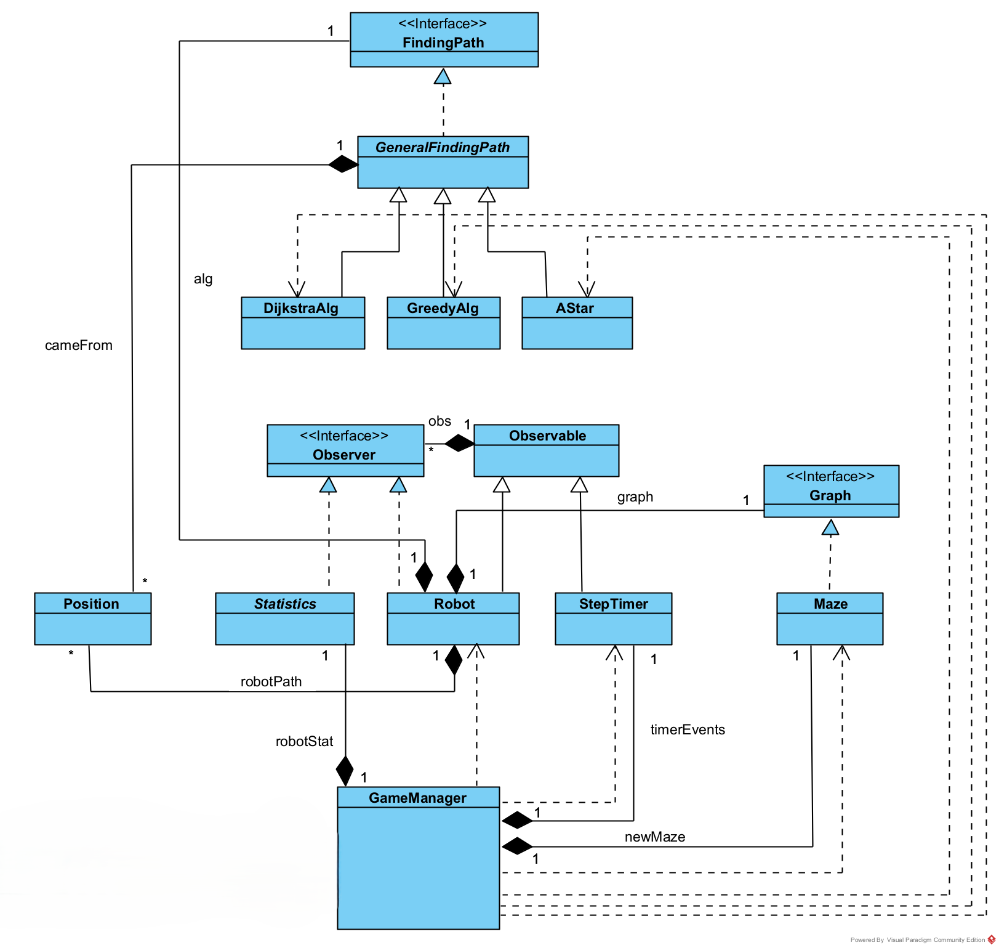
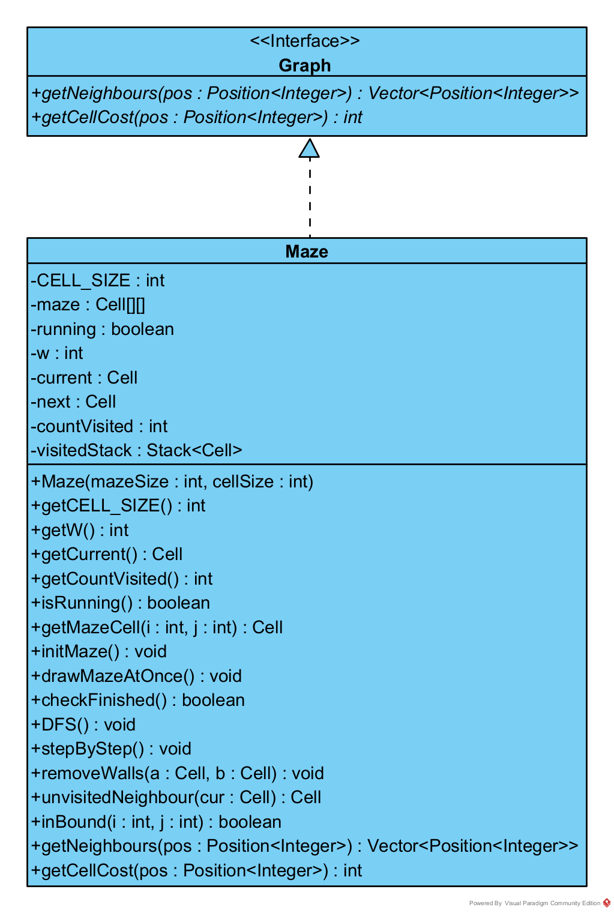
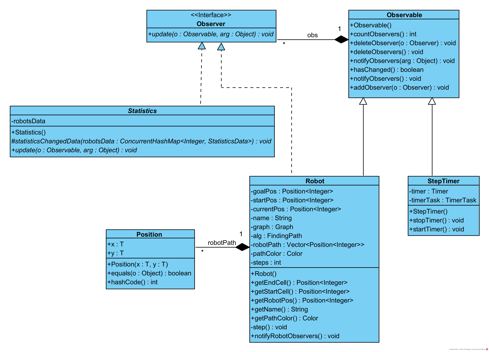
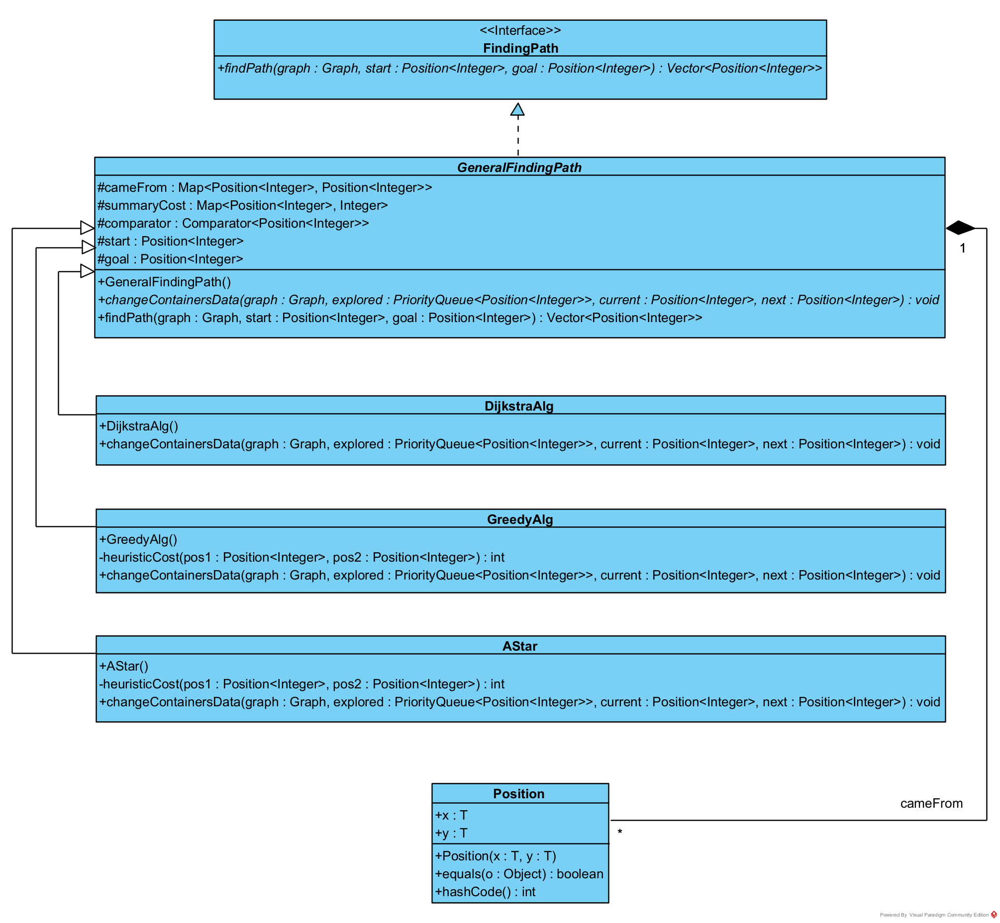

# Maze Escape Simulation

2022, 2025

This repository contains my contribution to a maze pathfinding simulation. The project's goal was to design a maze as a graph, where nodes represent intersections, entrances, or exits. Multiple "robots" attempt to find the exit using different pathfinding algorithms, relying only on limited environmental data—available paths from their current position and their traveled route. The task included implementing 4-5 types of robots and running step-by-step simulations in the form of a "robot competition" within various maze configurations.

As part of the team, I developed the OOP structure. I also implemented three pathfinding algorithms: Dijkstra’s, Greedy, and A\*. This part of the project is included in the first commit of this repository.

## Project Structure Description

### UML Diagram

Fig. 1 shows the UML diagram of my implementation.

Fig. 1

### Core Program Structure

To manage interactions between key objects: **Robot, Timer, Maze, and Statistics**, the **Observer** behavioral design pattern was used, along with an implementation of a **Graph** interface.

The main logic of object interaction works as follows:

1. Robot Initialisation:
When a **Robot** is created, it needs to obtain a path. The **Maze** class implements the **Graph** interface, which overrides the methods needed to find a path. This approach increases flexibility, allowing any **Maze** that implements **Graph** to be used for pathfinding. Fig. 2 illustrates this relationship.

Fig. 2

2. Robot Subscribes to Timer:
Once created, a **Robot** subscribes to the **Timer** as an observer. This enables the **Robot** to move one step forward each time the **Timer** ticks.

3. Statistics Subscribes to Robot:
 Each **Robot** registers an observer, **Statistics**, which updates every time the **Robot** moves. Fig. 3 shows this relationship.

Fig. 3

4. Simulation Start:
The **Timer** starts counting when the simulation begins, triggering the **Robots** to move.

5. Robot Reaches the Goal:
When a **Robot** reaches its destination, it unsubscribes from the **Timer** and removes **Statistics** as an observer.

6. Simulation Ends:
If no **Robots** are subscribed to the **Timer**, the simulation ends.

### Pathfinding Algorithms

This program implements three pathfinding algorithms: **Dijkstra’s Algorithm, Greedy Algorithm, and A\***. Each method finds the shortest path based on different criteria:

- **Dijkstra’s Algorithm** – Finds the path with the lowest total cost, where cost is determined by the value of each cell.
- **Greedy Algorithm** – Prioritises paths based on the heuristic (shortest Euclidean distance) between the start and goal positions.
- **A\*** – Combines both approaches, minimising cost based on both distance and cell values.

The **Strategy** behavioral design pattern was used to handle different pathfinding methods. Since these algorithms share a common structure, they inherit from an abstract class **GeneralPathFinding**, which defines a generic **findPath** method and an abstract **changeContainersData** method — where the core differences between algorithms are implemented.

So the **GeneralPathFinding** class has three subclasses: **DijkstraAlg**, **GreedyAlg**, **AStar**.

Each subclass overrides **changeContainersData** and uses a specific comparator to evaluate position costs. Fig. 4 illustrates this structure.

Fig. 4

